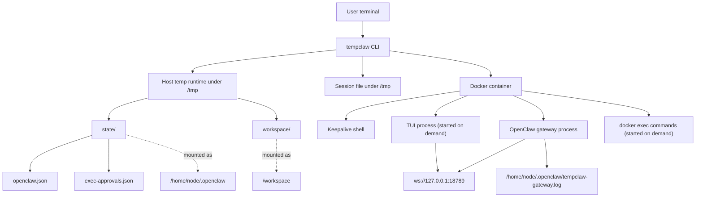
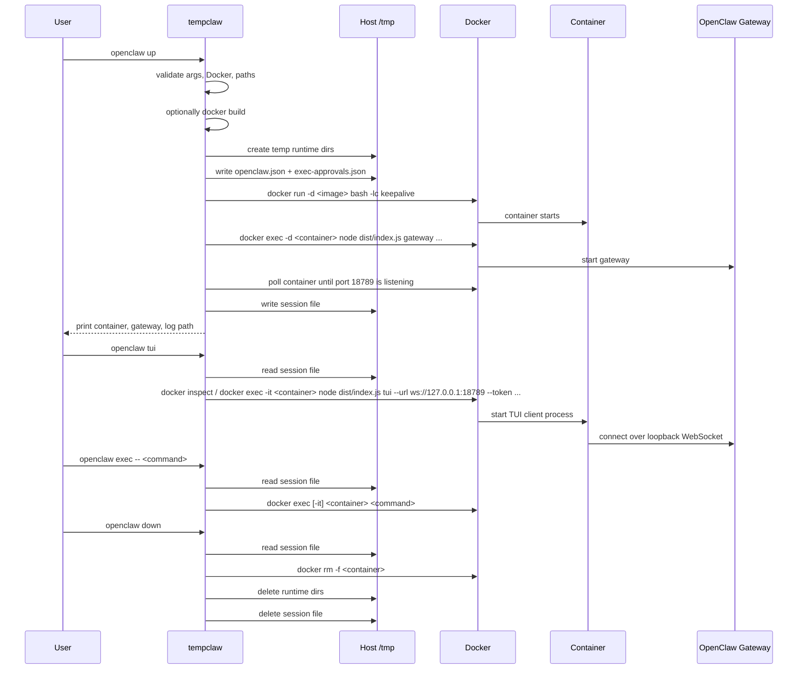

# Persistent Sandbox Flow

This document describes the persistent `tempclaw openclaw` lifecycle:

- `up`
- `tui`
- `exec`
- `down`

The legacy one-shot mode has been removed. `tempclaw` now manages one explicit persistent sandbox at a time.

## Overview

`tempclaw` is a thin Docker harness around an OpenClaw image. It does not keep the TUI running in the background. Instead, it keeps a Docker container and OpenClaw gateway alive, then attaches new interactive processes to that container as needed.

High-level behavior:

1. `up` prepares temp runtime state on the host and starts a detached container.
2. `up` starts the OpenClaw gateway inside that container.
3. `up` waits for the gateway to listen on `ws://127.0.0.1:18789`.
4. `up` writes a small session file so later commands know which sandbox to use.
5. `tui` starts a fresh OpenClaw TUI process inside the running container and connects it to the gateway.
6. `exec` runs arbitrary commands inside the same container.
7. `down` removes the container, temp runtime directories, and session file.

## Components



## Lifecycle



## Host State

`tempclaw` creates one temp runtime root per sandbox under `/tmp`. That runtime contains:

- `state/`
- `workspace/`
- `state/openclaw.json`
- `state/exec-approvals.json`

The state directory is mounted into the container as `/home/node/.openclaw`. The workspace directory is mounted as `/workspace`.

`tempclaw` also writes one session file at:

- `/tmp/tempclaw-openclaw-session.json`

That file points to the active container and temp runtime paths so `tui`, `exec`, and `down` can reuse the same sandbox.

## Docker Flow

### `up`

`up` starts a detached keepalive container, not the TUI. The keepalive command is just there to keep the container alive between later `docker exec` calls.

Shape of the startup flow:

```bash
docker run -d \
  --name tempclaw-openclaw-<random> \
  -v <stateDir>:/home/node/.openclaw \
  -v <workspaceDir>:/workspace \
  -v <pluginMounts...> \
  -v <extraMounts...> \
  -e OPENCLAW_CONFIG_PATH=/home/node/.openclaw/openclaw.json \
  -e OPENCLAW_STATE_DIR=/home/node/.openclaw \
  -e OPENCLAW_WORKSPACE_DIR=/workspace \
  -e OPENCLAW_GATEWAY_TOKEN=<token-if-set> \
  -e <extra env...> \
  <image> \
  bash -lc 'trap "exit 0" TERM INT; while true; do sleep 3600; done'
```

Then `tempclaw` starts the gateway separately:

```bash
docker exec -d <container> bash -lc \
  'node dist/index.js gateway --allow-unconfigured --bind loopback --port 18789 >> /home/node/.openclaw/tempclaw-gateway.log 2>&1'
```

### `tui`

`tui` starts a new interactive OpenClaw client process inside the existing container:

```bash
docker exec -it <container> \
  node dist/index.js tui --url ws://127.0.0.1:18789 --token <token-if-required>
```

This attaches to the already-running gateway. It does not resume a background TUI process, because there is no long-lived TUI process.

### `exec`

`exec` runs any other command in the same sandbox:

```bash
docker exec [-it] <container> <command...>
```

This is used for things like:

- `openclaw plugins list`
- `openclaw plugins install ...`
- `openclaw gateway restart`
- `tail -f /home/node/.openclaw/tempclaw-gateway.log`

### `down`

`down` destroys the sandbox completely:

- force-remove container
- delete temp runtime root
- delete session file

## Runtime Config Behavior

Before the container starts, `tempclaw` writes a runtime `openclaw.json` using either:

- a committed template at `assets/openclaw/openclaw.json`, or
- a user-provided `--configPath`

Then it applies runtime overrides such as:

- `--token`
- `--model`
- `--thinking`
- `--verbose`
- `--pluginPath`
- `--providerBaseUrl`

The generated config inside the sandbox is the source of truth for the gateway and later TUI attaches.

## Failure and Debugging Notes

Useful facts when debugging:

- Gateway logs live at `/home/node/.openclaw/tempclaw-gateway.log` inside the container.
- `docker logs` is usually not the useful signal here because the persistent container is just a keepalive shell.
- If the container dies, later `tui` or `exec` commands will fail session validation and tell you to start a new sandbox.
- `down` is the full cleanup path. If startup fails partway through, `tempclaw` also attempts to remove the container and temp runtime directories.

Useful commands:

```bash
npm run tempclaw -- openclaw up
npm run tempclaw -- openclaw exec -- tail -f /home/node/.openclaw/tempclaw-gateway.log
npm run tempclaw -- openclaw tui
npm run tempclaw -- openclaw down
```
